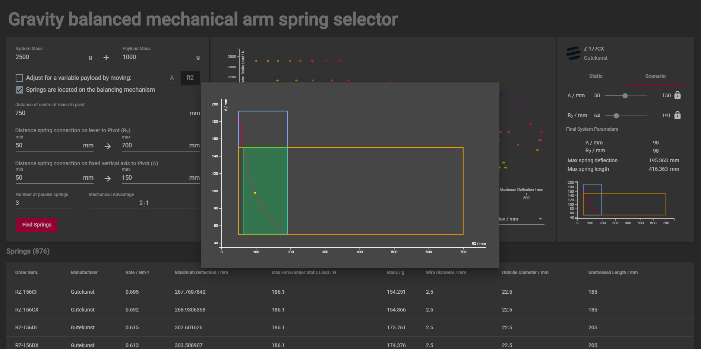

# wa-arm-spring-selector
**Workshop Automation: Workshop Arm: Spring selection service**

This repository contains of a small set of services that work together to provide an interface for selecting stock springs from a spring catalogue that will allow for the gravity balancing of a mechanical arm. This system is founded in earlier work done by Frank Beinersdorf with some minor functional expansions to allow for the spring mass to be included in the system mass and to allow for spring selections that can be used to balance variable payloads.

This project is part of wider work to design a template for a robotic arm to assist solo inventors in a workshop context, however, this tool can be used standalone for balancing any mechanical arm. It is assumed that the mechanical arm can be modelled such that it conforms to the general mechanical model shown below. Note that for a parallogram 4-bar linkage, the connection points for the spring will work on either of the horizontal bars and their respective vertical bars, as visualised by the dotted line in the diagram.

The tool reflects the mechanical structure shown using the following variables:

| Variable      | Description                                                                                          |
|---------------|------------------------------------------------------------------------------------------------------|
| R             | Distance from the pivot of the arm to the centre of mass of the arm (including the payload)          |
| R2 | Distance from the pivot of the arm to the arm connection point of the spring(s)                      |
| A             | Distance from the pivot to the vertical connection point of the spring(s)                            |
| MA            | The mechanical advantage of the system, presumably provided by a pulley system                       |
| ms | System mass - this is the mass of the mechanical arm being pivoted, excluding the spring if relevant |
| mp | Payload mass - the mass of the payload                                                               |
| N             | The number of springs to be used                                                                     |

If the arm is being designed to handle a variable payload then this needs to be taken in to account when selecting the spring(s) to balance it. For a spring-based gravity balancing mechanism there are two options for balancing a variable payload. Either the spring constant of the spring needs to change, or the connection points need to be moved based on the payload. It is impractical to physically swap the spring out during operation so it is assumed that balancing of a variable payload is achieved by moving one or both of the connection points, i.e. dynamically changing the distances A and R2.

## Tool Usage

Note: The separation between mp and ms is only relevant for

## Project Usage

This project is Gradle driven and consists of several sub-projects:
* **data** - Data: Spring databases and source files
* **core** - Core: The spring selection application. This is where the core logic lives and can be executed as a command line app.
* **ws** - Web Service: The RESTful web service wrapper around core
* **wa** - Wep App: A GUI web front end for interacting with the web service

Executing `gradle tasks` in the root folder of the main project or any of the sub-projects will provide a relevant lists of tasks that can be executed against that projeoct, e.g. gradle run or gradle build.

### Dependencies
While most of the projects use Gradle for dependency management, the Web App project (wa sub-folder) uses NPM via Angular to manage dependencies. This will result in the creation of a local `node_modules` folder. Please see the Web App section below for details on it's dependencies.

The other projects all require:

* Java 1.8+ : http://www.oracle.com/technetwork/java/javase/downloads/index.html
* Gradle 4+ : https://gradle.org/install/ 

### Core
This is the core logic and database executable as a command line application. It is also used as an integrated dependency of the web service. It is dependent on the data project and will compile and this include this as required. To run the application:

* Change to the `core` directory
* Execute `gradle run --args=''`. This will force the app to tell you what command line parameters are required to use it.

**Note**: Running `gradle run` with no arguments will execute the app with some default command line arguments. These arguments can be found in the `gradle.build` file under the core sub-project directory.

### Web Service
This is the RESTful web service that allows for remote connection and use of the Core app and database.

* Change to the `ws` directory
* Execute `gradle run`. This will start up the web service at http://localhost:8080/.

### Web App
This is the graphical front end interface to the web service.

At present this sub-project is not integrated into the gradle build.

Note: To run the web app (wa sub-project) you will need the following pre-requisites installed:
* Node.js and NPM: https://nodejs.org/en/download/
* Angular CLI: To install this, execute `npm install -g @angular/cli`

Make sure the web service is already running on the local machine as this app will connect to it.

* Change to the `wa` directory
* Run `npm i` to download all javascript dependencies. This will take a while the first time and you don't need to do it again.
* Run `ng serve --open`. This will start the web app running on a local Node web server instance and open the web app in your system's default web browser.

### IDEs
#### Eclipse
Despite the Gradle Eclipse plugin being applied in the build file, Eclipse integration works best if you *DON'T* use the command line eclipse generation tools in Gradle. Simply check out the project from github and then use the Eclipse->File->Import... function and import an existing Gradle project. The Eclipse project structure should be correctly generated at that point.

Please note that, at the time of writing, Gradle test and Eclipse debug capability are not yet integrated in the Eclipse Gradle buildship plugin, though you can manually set up a remote debug target to a gradle test execution instance in Eclipse.

#### Visual Studio Code
VS Code was used for the creation and modification of the Web App. Simply opening the project folder in VS Code should be sufficient for VS Code to function. I use the following extensions for this project which youmaywish to consider:
* Angular 6 Snippets
* Markdown All In One
* Java Extension Pack

## Spring Manufacturers
A web search of "local" New Zealand spring manufacturers was undertaken and those that had easier to parse stock catalogues have their springs listed in this app. In addition to these, Gutekunst and Knoerzer had previously been compiled by Frank Beinersdorf and these are also included in the Spring database.

Legend: R = Researched, L = Listed

| Company | URL | Status |
|---------|-----|--------|
| Century Springs | http://centurysprings.co.nz/ | L |
| Bearing & Engineering Supplies Ltd. | https://www.bearingandengineering.co.nz/ | R |
| National Springs & Wire Products NZ Ltd. | http://www.natspring.co.nz/ | R |
| Spring Specialists Limited | http://www.springspecialists.co.nz/ | R |
| Gutekunst Federn | https://www.federnshop.com/en/ | L |
| Federntechnik Knoenzer | https://www.knoerzer.eu/ | L |

### Century Springs
The spring data was copied from their PDF catalogues available online. Once scraped, it became evident that the catalogues had a small number of data errors in addition to a significant number of problems being introduced as a result of scraping the data from PDF in the first place. The original scraped source pages can be found in the `data/centurysprings` directory. 

Cleanup scripts were created to process the raw pages and generate a single CSV output. This process can be re-executed by running the `clean.sh` script (`-h` as an argument to get usage instructions). Please note that this requires `sed` and `awk` to be available on the command line. This was tested and proven to work on a MinGW terminal on Windows. No other environment has been verified at this stage.

### Gutekunst Federn
The spring data was collated from their catalogue by Frank Beinersdorf and the final curated CSV can be found in the `data/gutekunst` project.

### Knoerzer
Spring data from Knoerzer was already included in the curated spring data collected by Frank Beinersdorf and can therefore be found in the `data/gutekunst` project.

## References
* Gradle multi-project builds: https://docs.gradle.org/current/userguide/multi_project_builds.html
* Jersey JSON / Moxy: https://jersey.github.io/documentation/latest/media.html#json.moxy
* HSQLDB Text Tables: http://hsqldb.org/doc/guide/texttables-chapt.html
* D3.JS / C3.JS / REST Example: https://github.com/Automattic/grasshopper
* Angular tutorial: https://angular.io/tutorial
* Angular event distribution: https://angularfirebase.com/lessons/sharing-data-between-angular-components-four-methods/
* Angular + C3.js: https://stackoverflow.com/questions/46250941/how-add-c3-charts-to-angular-2-project
* Angular observables: https://angular.io/guide/observables
* Angular material icons: https://material.io/tools/icons/?style=baseline
* Angular material theming: https://medium.com/@tomastrajan/the-complete-guide-to-angular-material-themes-4d165a9d24d1
* D3.js colour functions: https://github.com/d3/d3-scale-chromatic/blob/master/README.md#interpolateWarm
